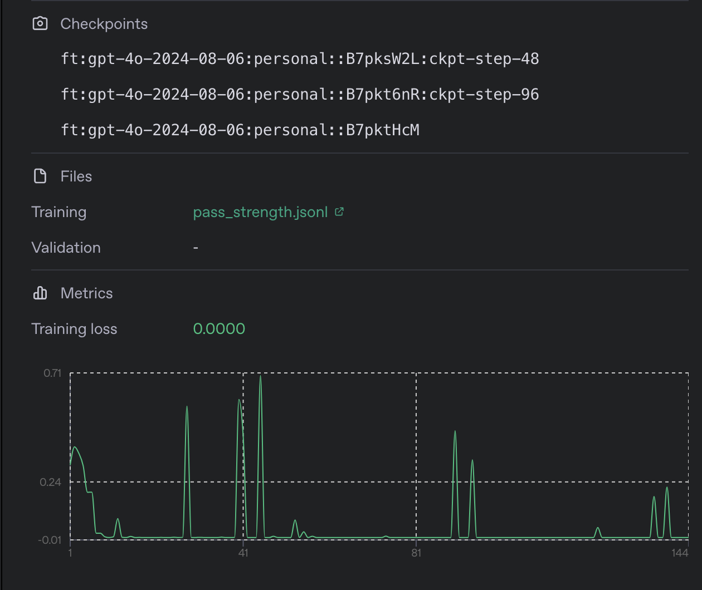

# AI-Powered Password Strength Checker

A sophisticated web application powered by a custom fine-tuned GPT-4 model, specifically trained on an extensive dataset of password breaches and security patterns. This application goes beyond traditional password checkers by leveraging advanced AI to provide intelligent, context-aware password strength analysis and suggestions.

## UI/UX:


## 🎯 Why This Password Checker?

- **AI-Powered Intelligence**: Our fine-tuned model has been trained on:
  - <a href="https://www.kaggle.com/datasets/bhavikbb/password-strength-classifier-dataset">Password Strength Classifier Dataset</a> (along with suggested stronger passwords)
  - The <a href="https://www.proxynova.com/tools/comb">COMB</a> (Combination of Many Breaches) dataset containing 3.2+ billion (around 100 for now due to computational limitations) leaked credentials
  - Advanced password security patterns and best practices
  - Real-world breach analysis and vulnerability patterns
  
- **Smart Context-Aware Analysis**: Unlike traditional checkers that use simple rules:
  - Understands password patterns and common variations
  - Recognizes sophisticated attack vectors
  - Provides intelligent, contextual suggestions based on your input

## 🧠 Model Training Metrics



Our model was fine-tuned to achieve optimal performance in password strength prediction, with training metrics showing consistent improvement in accuracy and reliability.

## 🌟 Features

- **Advanced AI Analysis**: 
  - Custom fine-tuned GPT-4 model trained on real-world password breach data
  - Intelligent pattern recognition for vulnerability assessment
  - Context-aware strength evaluation based on extensive training
- **Smart Suggestions**: 
  - Generates password suggestions that maintain context with the original input
  - Ensures minimum 16-character length for suggested passwords
  - Includes a mix of uppercase, lowercase, numbers, and special characters
  - Avoids patterns found in known data breaches
- **Real-time Security Assessment**:
  - Instant strength evaluation against known breach patterns
  - Score-based evaluation (0-2) with detailed security context
  - Intelligent improvement suggestions based on identified vulnerabilities
- **Modern UI/UX**:
  - Responsive design with real-time feedback
  - Interactive strength visualization
  - Smooth animations and transitions
  - Dual theme support (Cyberpunk/Pastel)

## 🛠️ Tech Stack

### AI/Backend
- Custom fine-tuned GPT-4 model trained on:
  - <a href="https://www.kaggle.com/datasets/bhavikbb/password-strength-classifier-dataset">Password Strength Classifier Dataset</a>
  - 3.2B+ leaked credentials from the COMB dataset
  - Advanced password security patterns
  - Common breach vulnerabilities
- FastAPI (Python web framework)
- aiohttp (Async HTTP client)
- python-dotenv (Environment management)
- Uvicorn (ASGI server)

### Frontend
- React with TypeScript
- Vite (Build tool)
- Framer Motion (Animations)
- TailwindCSS (Styling)
- Three.js & React Three Fiber (3D effects)

## 🚀 Getting Started

### Prerequisites
- Python 3.11
- Node.js 16+
- OpenAI API key with access to the fine-tuned model

### Backend Setup

1. Navigate to the backend directory:
   ```bash
   cd backend
   ```

2. Create and activate a virtual environment:
   ```bash
   python3 -m venv venv
   source venv/bin/activate  # Windows: venv\Scripts\activate
   ```

3. Install dependencies:
   ```bash
   pip install -r requirements.txt
   ```

4. Set up environment variables:
   ```bash
   cp .env.example .env
   ```
   Then edit `.env` and replace `your-openrouter-api-key-here` with your actual OpenAI API key.

5. Start the backend server:
   ```bash
   uvicorn main:app --reload
   ```

The backend will run on http://localhost:8000

## 📝 API Endpoints (Test this before running the frontend)

### POST (method) /check-password
Checks password strength and provides suggestions.

Example Request body:
``` json
yashlal@Yashs-MacBook-Air-4 backend % curl -X POST -H "Content-Type: application/json" -d '{"password":"MyStr0ng@P@ssw0rd2024!"}' http://localhost:8000/check-password
```

Example Response:
```json
{"score":2,"suggestion":"Damn Bro Crazy Password!"}

```


### Frontend Setup

1. Navigate to the frontend directory:
   ```bash
   cd frontend
   ```

2. Install dependencies:
   ```bash
   npm install
   ```

3. Start the development server:
   ```bash
   npm run dev
   ```

The frontend will run on http://localhost:5173

## 🔒 Password Scoring Criteria

Our AI model evaluates passwords based on sophisticated criteria learned from real-world data:

- **Score 0 (Weak)**:
  - Matches patterns found in breach databases
  - Uses common substitutions (e.g., 'a' → '@')
  - Lacks sufficient complexity or length
  - Vulnerable to dictionary attacks

- **Score 1 (Medium)**:
  - Better than common patterns
  - Has decent complexity
  - Not found in common breach databases
  - Could be strengthened further

- **Score 2 (Strong)**:
  - Highly complex with 16+ characters
  - Uses unique character combinations
  - Resistant to common attack patterns
  - Follows latest security best practices

## 🤝 Contributing

1. Fork the repository
2. Create your feature branch (`git checkout -b feature/AmazingFeature`)
3. Commit your changes (`git commit -m 'Add some AmazingFeature'`)
4. Push to the branch (`git push origin feature/AmazingFeature`)
5. Open a Pull Request

## 📜 License

This project is licensed under the MIT License - see the [LICENSE](LICENSE) file for details.

## 🏆 Model Performance

Our fine-tuned model has been extensively tested against:
- Known password breach databases
- Common attack patterns
- Industry standard password security tools
- Real-world security scenarios
